Click here to return to alexlorman.com

# Replacement Seamaster Calypso Dial
I very much like the 80s vintage Omega Seamaster quartz watches, particularly some of the thin dive-style watches that use the 1337 movement. 

## Existing Condition
I purchased a __very__ beaten up Seamaster Calypso III in the rare black-on-black colorways on ebay.  
Known issues:  
- Major scratching on bezel insert
- Non-working movement
- Paint on hands in terrible shape

Here it is once I had removed the original face to document the sizes. 
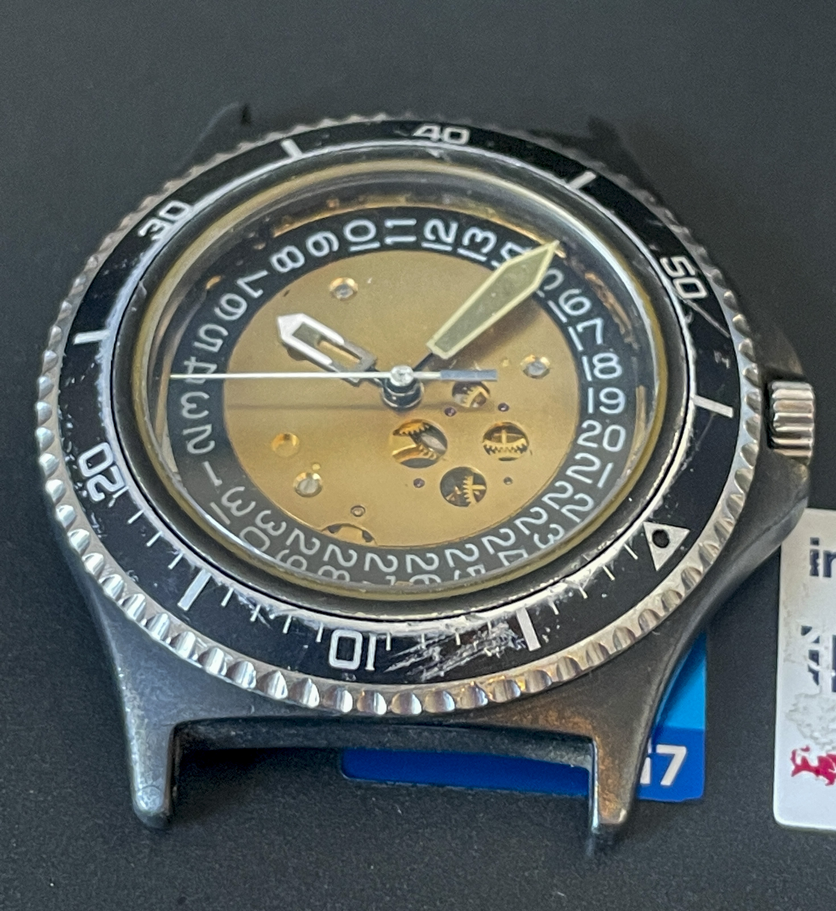

I decided to rebuild this to a history-accurate but not "numbers-matching" resto-mod. 

PCB fabrication seemed the like an easy way to make a super high accuracy physical layout with good and clear silkscreening. I've done a fair amount of PCB design and assembly, so i though I would try it out. These are the results. 

## Disassembly and Reverse Engineering
After removing the dial (for which you have to remove the entire movement and hands), I used a dSLR to take photos of them with scale references as perpendicular as I could. 
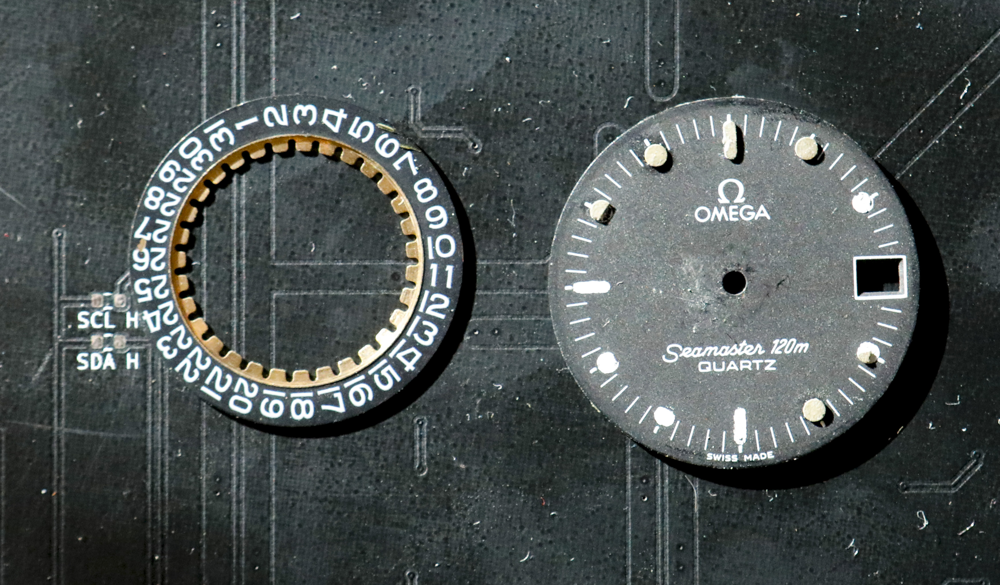

I then laid out vectors for the outline, indexes et al in Illustrator. 
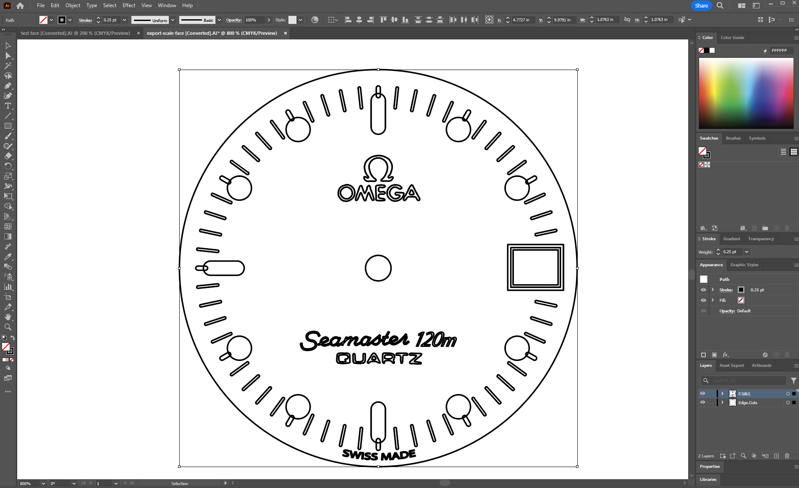

I moved these vectors into KiCad 6 (at the time), added a few features and sent it to fabrication.
[KiCad files are here](https://github.com/alorman/Seamaster-Face/tree/main/PCB). I prototyped two versions, one with holes at the indexes, one without. I wasn't sure which one would be better for hand lume. It turned out that the one with circles cut out were.  
The vertical lines were added to make alignment on the movement easier. 
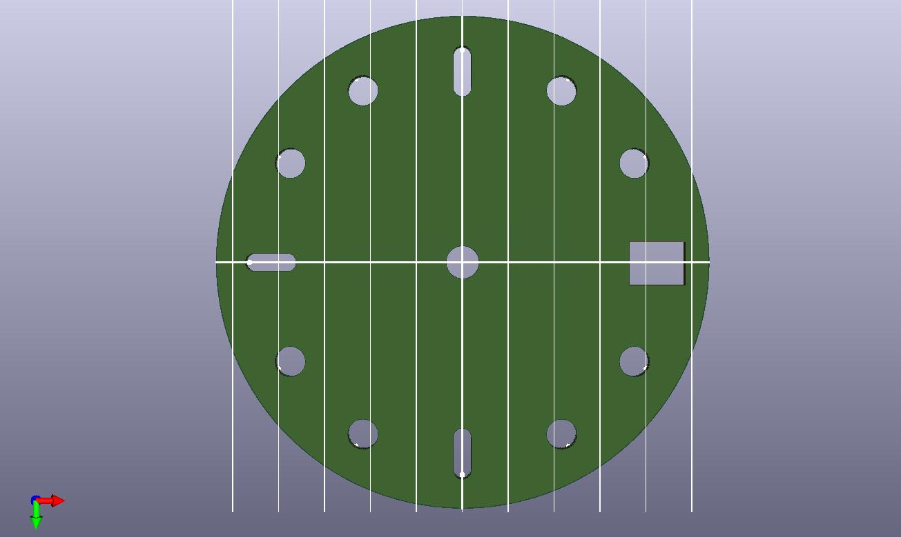 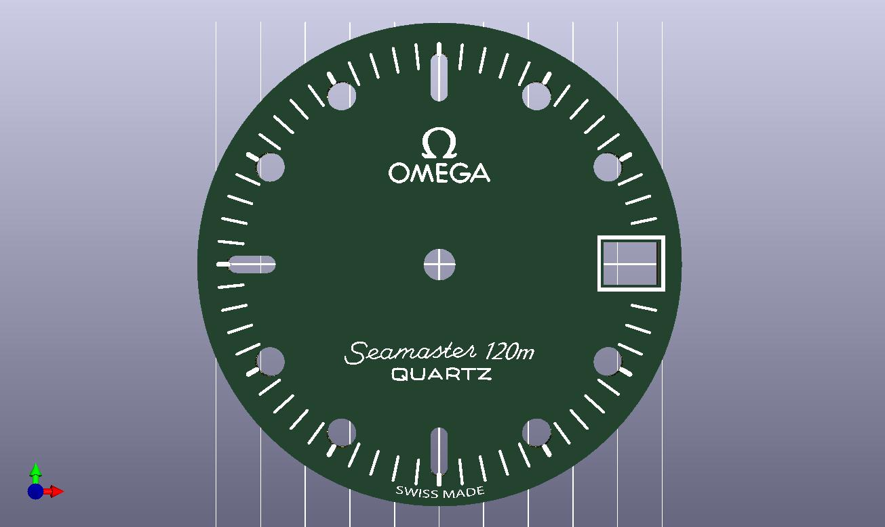

## Painting and Installing
I used the lume kit from [Noctilumina](https://www.noctilumina.com/) and some very fine watch oiling tools (from Amazon) to apply the thickened lume compound.  
The best technique I found was to tape apply packing tape the back of the face PCBs then use the surface tension of the lume to fill out the pockets. Obviously use gloves or finger cots for this.
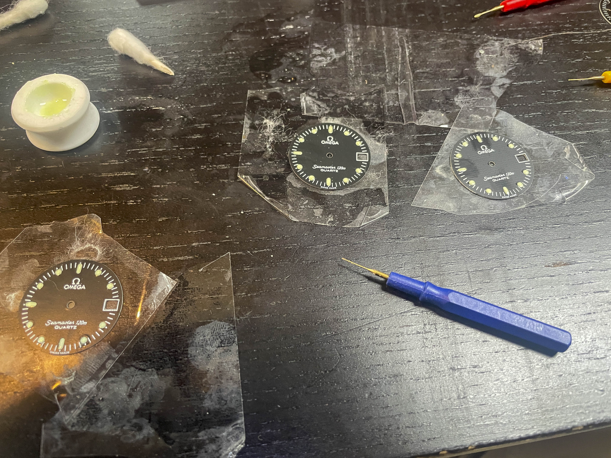

I have no idea what the white strands are, in retrospect.

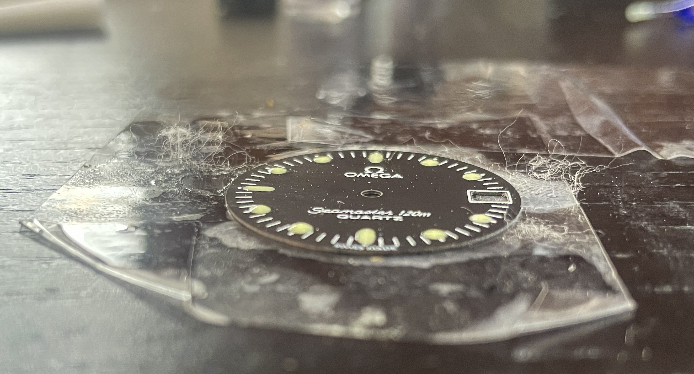

The finished face does show some VERY faint patterning when viewed in exactly the right light. Normally (and as you can see later) this isn't an issue. 

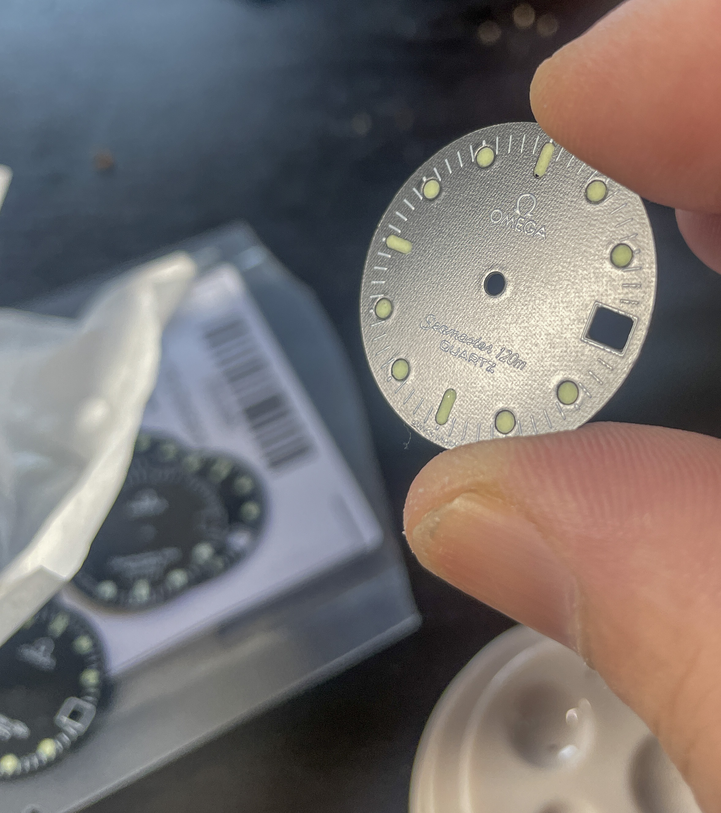

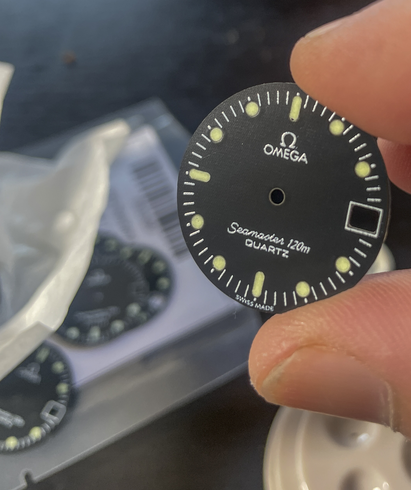

I then reassembled the movement. Since I wasn't able to fully replace the alignment pins on the original face, I glued mine down with a tiny amount of CA glue. 

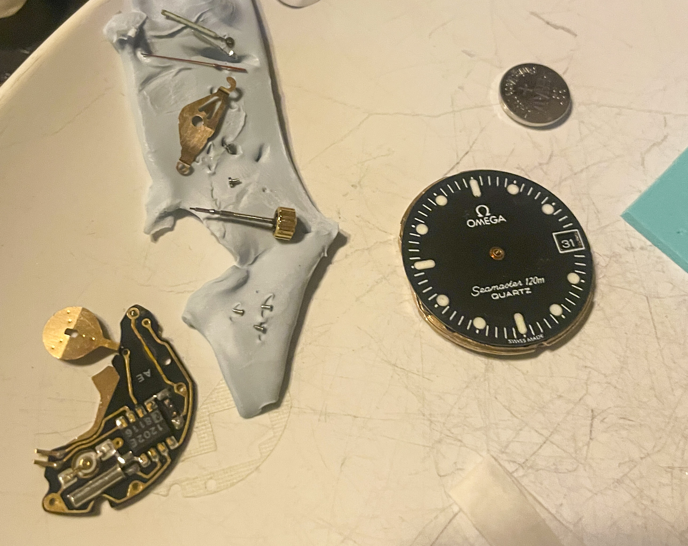

**NOTE** I had to realign the height of the glue several times to make sure I didn't interfere with the date wheel movement. **ALWAYS** check your datewheel movement before putting the watch back in the case. 

## Final Assembled Watch
After putting everything back together, I also replaced the bezel insert (a write-up for another day), and repainted and lumed the hands. 

I purchased a sailcloth band from [Artem](https://artemstraps.com/) who are pretty great people and make a quality product.

The total cost of the PCBs for this project was about $50 USD and I sourced them from the usual PCB fab houses.

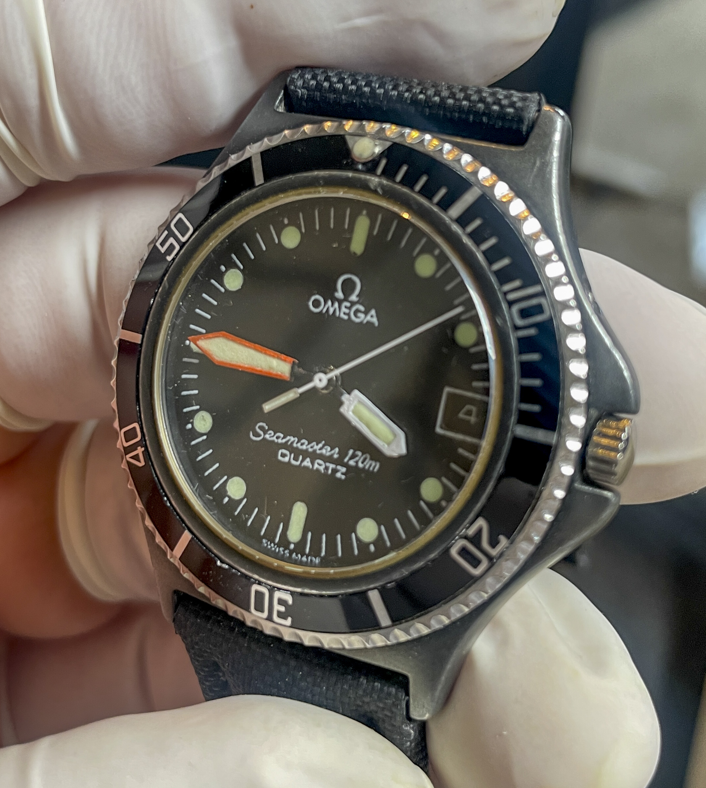

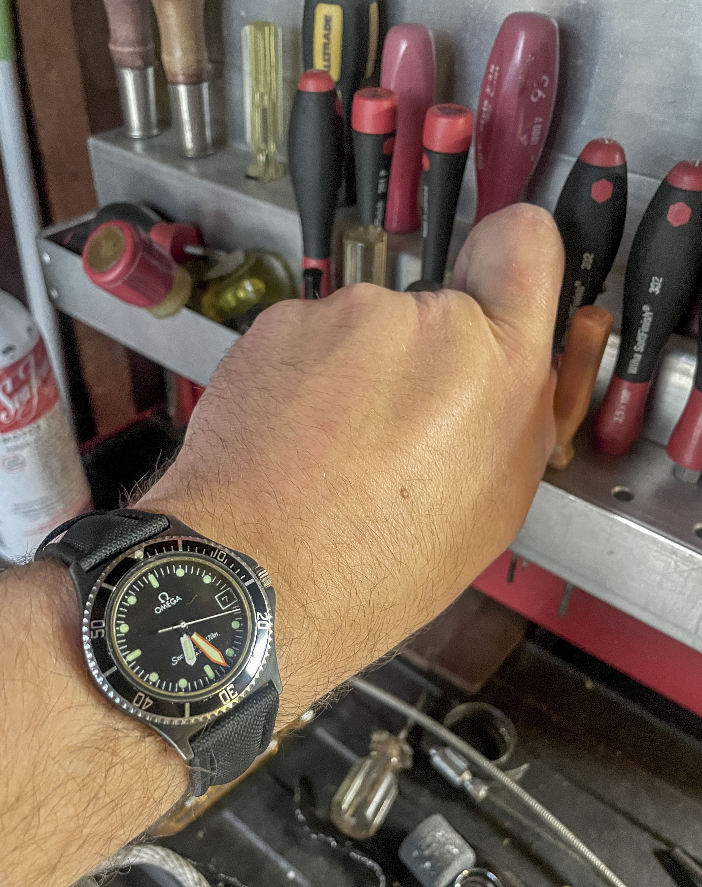
